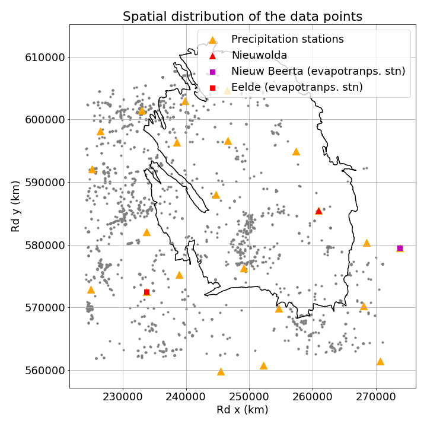
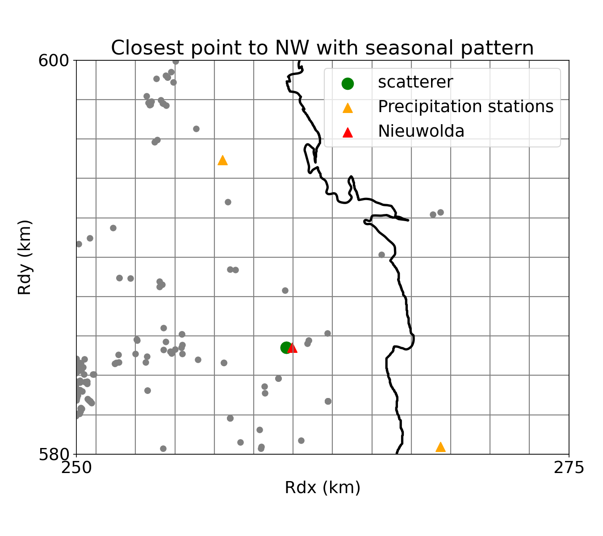
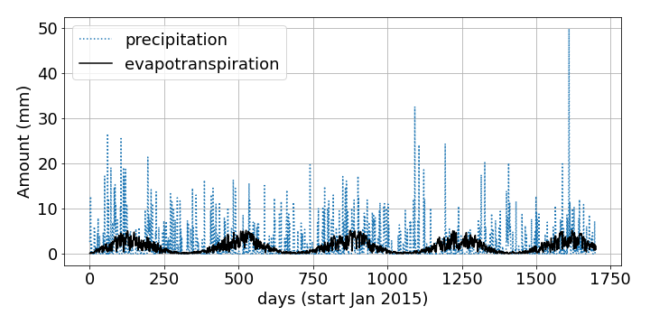

# Particle filter application for Nieuwolda (Groningen gas field)

This repository provides a simple example of a particle filter application for estimating parameters of a subsidence model.
We use the subsidence model SPAMS (Conroy et al. 2022) which correlates soil motion with meteorological data from the KNMI.

In the following we use subsidence observations from PS-InSAR. In this example, PS-InSAR are averaged over a certain area of interest.

## 1. Meteorological data
### 1a. Groningen region and the Nieuwolda station

### 2a. Precipitation and evapotranspiration data
Data are available on the KNMI website.
For the daily precipitation:
<a href="https://www.knmi.nl/kennis-en-datacentrum/achtergrond/achtergrondinformatie-maandoverzicht-neerslag-en-verdamping-in-nederland-monv">https://www.knmi.nl/kennis-en-datacentrum/achtergrond/achtergrondinformatie-maandoverzicht-neerslag-en-verdamping-in-nederland-monv</a>

For the daily evapotranspiration:
<a href="https://www.knmi.nl/nederland-nu/klimatologie/gegevens/monv">https://www.knmi.nl/nederland-nu/klimatologie/gegevens/monv</a>

For this repository, I've made a csv file with the available stations in a region of interest in the Groningen region:

## 2. SPAMS model

Details on the SPAMS model has been developped by TUDelft and can be found in the publication:
<a href="https://www.sciencedirect.com/science/article/pii/S0016706123003762">https://www.sciencedirect.com/science/article/pii/S0016706123003762</a>

## 3. Run the Jupyter notebook

- Require geopandas environment
